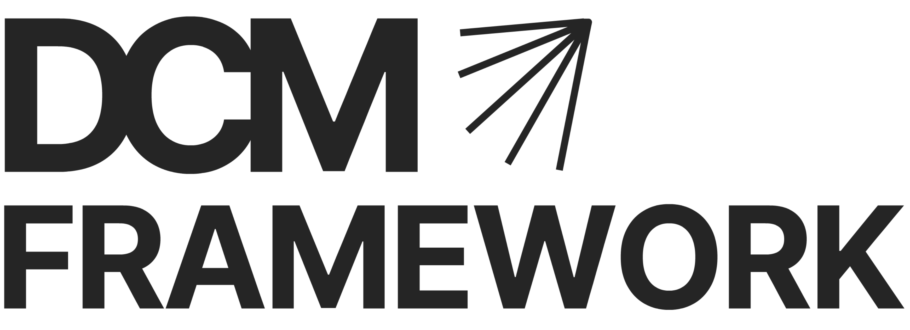
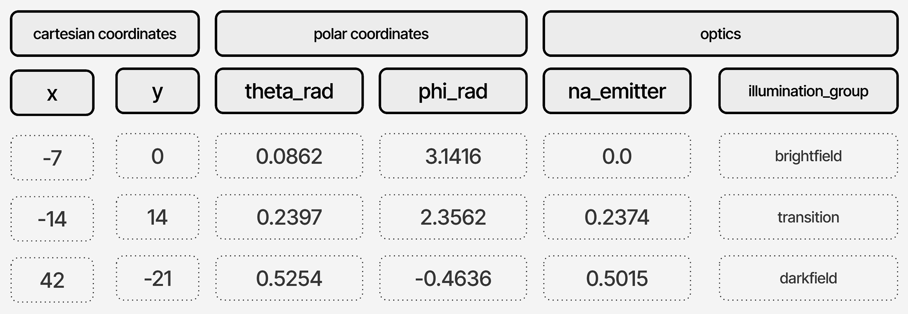
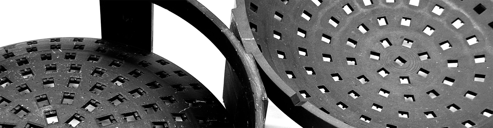
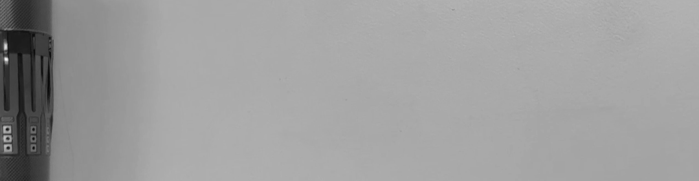
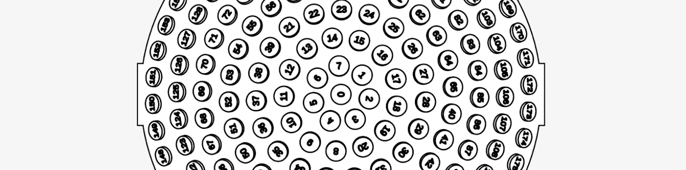
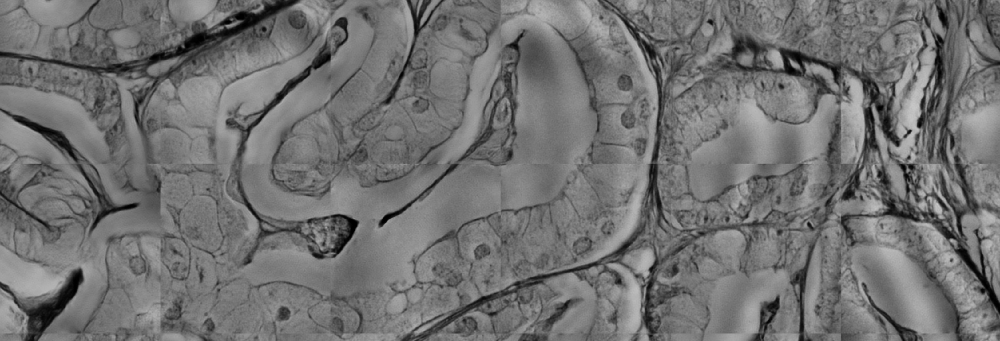

&nbsp;
&nbsp;

<picture>
  <source media="(prefers-color-scheme: dark)" srcset="./presentation/graphics/logos/dcm_framework_logo_dark.png">
  <source media="(prefers-color-scheme: light)" srcset="./presentation/graphics/logos/dcm_framework_logo_light.png">
  
</picture>

&nbsp;
&nbsp;

**Digital Condenser Microscopy Framework** is an open-source software toolkit that helps to design, build, and use custom illuminators for [Fourier Ptychographic Microscopy](https://smartimaging.uconn.edu/fourier-ptychtography/) (FPM).

&nbsp;

> [!NOTE]
> For dome illuminator-friendly flexible LED chains, please see ***[Fluxure](https://github.com/icgi/fluxure/tree/main)***

> [!CAUTION]
> This project is in the proof-of-concept phase. The API is not yet stable. Please use with caution.

&nbsp;

## Usage

```
python -m dcm_framework build_experiment
```

## Features

### Interactive Protocol Builder

<p align="center">

</p>

FPM experiment specifications and metadata can be expressed in many ways, which makes it hard to integrate across pipelines. With ***DCM Framework***, we propose a simple tabular FPM experiment protocol format to express parameters for repeated entities, such as emitters. To lower the threshold for creating compliant protocols, the ***DCM Framework*** offers an interactive builder with command-line interface. By selecting options and specifying the geometry parameters, you can create a protocol to use with your acquisition software. Additionally, you can leverage protocols to create various assets such as 

   * 3D printable illuminator shell models with custom cutouts for your light-emitting diodes
   * Interactive previews with panning and zooming, and user's custom visualisation channels to view in relative positions associated with your emitters (eg. histograms, normalised intensities, Fourier spectrum).

&nbsp;

### Parametric Illuminator Shells

<p align="center">

</p>

Light-emitting diodes are a common type of light source in FPM illuminators. To arrange the emitters according to the illumination model, this framework subtracts the emitter slot from 3D-printable illuminator body using a parametric computer-aided design environment [OpenSCAD](https://openscad.org/). With some tuning, the resulting emitter slots can retain LED packages via snap-fit, eliminating the need for adhesives. For hemispherical arrays, the *sector mode* can be used to test the fit of the emitter packages at different rings of the shell. Our experiments relied on stereolithographic printing process ([SLA](https://en.wikipedia.org/wiki/Stereolithography)) to test several illuminator designs. Ring-specific scaling was tuned to address height-dependent variations in emitter slot size caused by 3D-printing imperfections.


&nbsp;

### ***Fluxure*** Emitter Chains

<p align="center">

</p>

We are providing open designs for *[Fluxure](https://github.com/icgi/fluxure/)* emitter chains that fit the aforementioned 3D-printable shells. With more degrees of freedom and greater torsion tolerance, the emitter chains can accommodate ring transitions and gaps in most challenging layouts. ***Fluxures*** maintain consistent orientation for off-axis LEDs, eliminating the need for emitter-specific junction offsets. In addition, the emitter chains can be stretched (3-to-1 ratio) and connected to other segments for length extension and repair.

To achieve high coverage, FPM requires a large number of emitters, each connected to a minimum of power, ground, and a data line. For the largest arrays, the individual LED connections are impractical and error-prone. Consequently, FPM researchers often rely on a *NeoPixel*-style (cascaded serial chain of self-clocking addressable nodes) interconnect, or "daisy chain", with a timing-coded one-wire protocol (e.g., `WS2812`, `SKC6812RV`, `IN-PI554FCH`, or `APA-104`). To our knowledge, the common form factors are flexible strips, flat rings, and stars with *fixed azimuthal angle*. However, these form factors are less suitable for optimising layouts in true hemispherical illuminators. Manual assembly of such chains emitter by emitter may require complicated soldering (see *[Akram et al., 2023](https://doi.org/10.1364/OE.469115)*). ***Fluxure*** emitter chains are an attempt to lower the threshold in constructing true hemispherical shell shapes, and to encourage further optimisation of illuminator form factors.

*Please see the [project page](https://github.com/icgi/fluxure/)  for more information.*

&nbsp;

### Light Emitter Enumeration



Within the ***DCM Framework***, the emitter enumeration follows the order of LEDs in the emitter chain and is retained throughout the experiment. The order is preserved in two ways. In the assembly phase, the user is provided with a three-dimensional guide (see illustration) visualising the exact order of the emitters. The visual guide helps prevent cascading errors due to mirroring or misplaced ring transitions. During the experiment and in interaction with the firmware, the mapping between emitters and their software representation is determined by the `ordinal` column of the experiment protocol.

&nbsp;

### End-to-End Metadata Routing

The protocol system routes acquisition parameters and metadata throughout the experiment, discouraging recalculation and minimising precision loss. In addition, the protocols serve as explicit documentation of the illumination model and acquisition parameters, thereby increasing the portability of FPM experiments. Protocols can be consumed by downstream tools and ***DCM Framework*** plugins, while also accommodating new information (such as reports and asset paths), in a singular file-based experiment snapshot.

&nbsp;

### Ptychogram Navigator

<p align="center">

</p>

After FPM data acquisition, several types of model-mismatch artefacts can be more easily identified using a high-resolution ptychogram preview. Such artefacts include intensity fluctuations, vignetting, exposure mismatch, and, most importantly, emitter angle misalignment and pose errors. The *Ptychogram Navigator* supports pan-and-zoom navigation with a lossy version of the original images for preview. Additionally, the user can extend the dataset viewed by the navigator by creating their own channels and enable them by typing the name in the free text input field. The only prerequisite is for the browser of choice to support the new channel's image type (compressed `jpeg` is recommended) and that the image file names follow the naming pattern in the protocol. *Ptychogram Navigator* is a portable, protocol-specific `html` file supported by any modern browser and requiring only adherence to the output folder structure specified in the protocol.

&nbsp;


## Glossary

* `ptychogram` — a set of intensity measurements of a sample captured under varying illumination angles
* `ptychogram frame` — a single intensity recording stemming from an angle or group (if multiplexing is used)
* `emitter` — the set of electronics contained within a single LED package
* `junction` — an element inside the `emitter` capable of emitting energy in a specific form or band (eg, a specific wavelength of light)
* `mode` — a system-wide single ASCII symbol referring to the acquisition mode. Designates wavelengths and
* `shell` — the plastic mold for placing the emitters at the angles corresponding to the illumination model used for reconstruction (can be hemispherical or planar)
* `layout` — the angle set that decides where each emitter center will be when projected either onto a plane or onto a hemisphere
* `illuminator` — a physical arrangement of emitters that can capture a full ptychogram for a given layout
* `illumination model` — a mathematical description of the light field reaching the specimen, including the angular distribution of the light source and the properties of the optical system

&nbsp;
&nbsp;

## Accessible, Robust Fourier Ptychography

<p align="center">

</p>

*Image of an FPM reconstructed label-free prostate tissue section acquired with four times magnification and near infra-red illumination.*

DCM Framework is a part of the **ENDPATH** project, that aims to provide a robust foundation for use of computational microscopy in medical machine learning and risk stratification of cancer patients.

&nbsp;
&nbsp;

---

&nbsp;
&nbsp;

## Notable Dependencies

   * **[OpenSCAD](https://openscad.org/)** generates parametric 3D geometry from source files using script-based DSL.
   * **[Jinja2](https://github.com/pallets/jinja)** generates text-based output such as code from templates and structured data.
   * **[Pandas](https://pandas.pydata.org/)** simplifies working with structured and tabular data.
   * **[Questionary](https://questionary.readthedocs.io/en/stable/)** builds interactive command-line prompts and user input flows.
   * **[Fire](https://github.com/google/python-fire)** creates CLIs from Python code.
   * **[Pint](https://pint.readthedocs.io/en/stable/)** performs units and quantity-aware calculations

&nbsp;
&nbsp;

> [!NOTE]
> To enable fast rendering in `OpenSCAD`, please use the Manifold backend in one of the [recent releases](https://github.com/openscad/openscad/releases).

&nbsp;
&nbsp;
